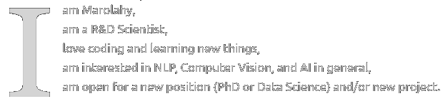

<!-- 

    

 -->
<svg viewBox="0 0 0 0" xmlns="http://www.w3.org/2000/svg">
    

<!-- <h2> Hello there 
</h2>  -->

<foreignObject x="20" y="20" width="160" height="160">
        I

am Marolahy,  am a R&D Scientist,   love coding and learning new things,   am interested in NLP, Computer Vision, and AI in general,   am open for a new position (PhD or Data Science) and/or new project.
 </foreignObject>
</svg>
 

##  I'm currently working on

- my portfolio website
- update my old projects

 

## 🌱 I'm currently learning

- Pyspark
- Deploy Machine Learning Models to Production
- The Azure Data Lakehouse Toolkit
- Spanish from 

 

##  Tools

 

<!-- 
 -->

 

##  Portfolio: 
<a href="https://marolai.github.io/">https://marolai.github.io/</a>

 

## Connect with me :

 &nbsp;
&nbsp;
&nbsp;

 

##  Contact:
arabetokotany[at]aimsammi[dot]org

 

    
    <h2>Thank you for your visit!</h2>

